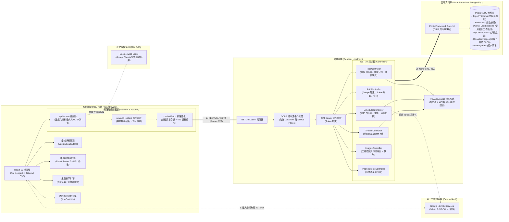
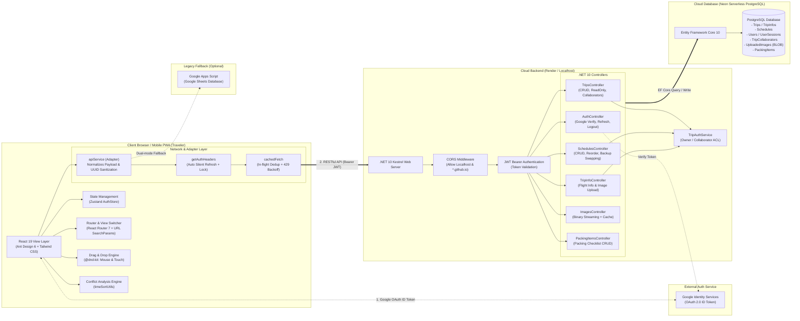
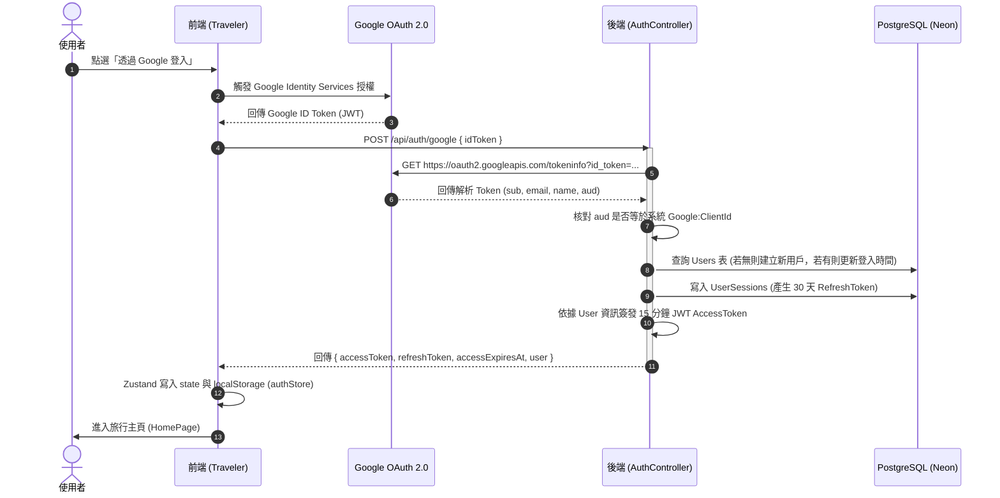
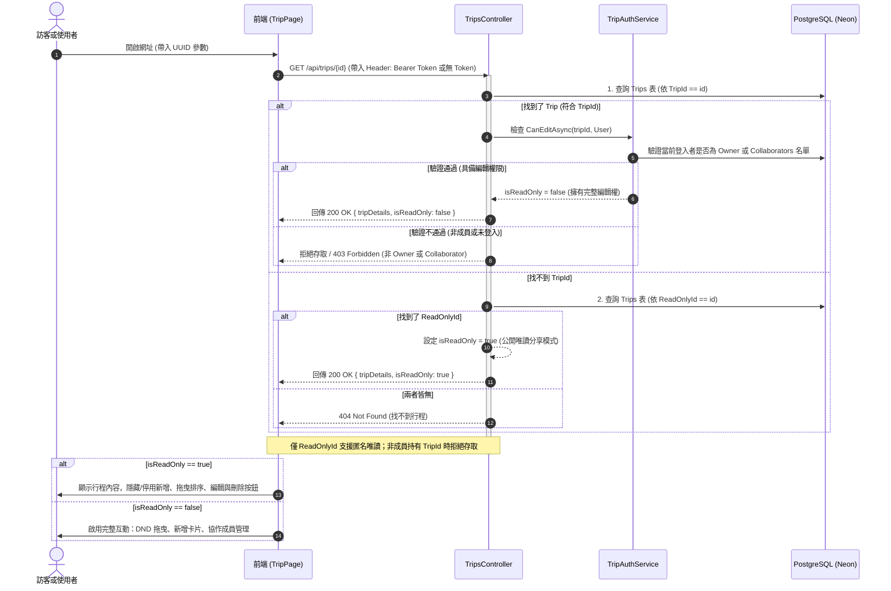
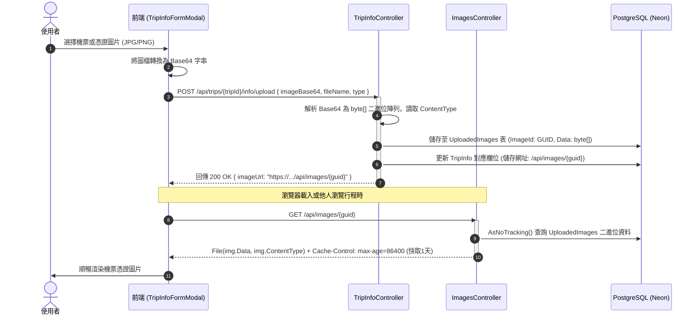

# Traveler & Travel-App-API 全端系統架構與技術解析文件

本文件全面解析 **Traveler (前端 React SPA / PWA)** 與 **Travel-App-API (後端 ASP.NET Core 10 Web API)** 的系統整體架構、資料流程、資料庫關聯以及 7 大關鍵技術亮點。

---

## 目錄
1. [系統整體架構圖 (Architecture Overview)](#1-系統整體架構圖-architecture-overview)
   - [1.1 中文架構圖 (Chinese Architecture Diagram)](#11-中文架構圖-chinese-architecture-diagram)
   - [1.2 英文原版架構圖 (Original English Diagram)](#12-英文原版架構圖-original-english-diagram)
2. [前後端技術棧總覽 (Technology Stack)](#2-前後端技術棧總覽-technology-stack)
3. [資料庫實體關係圖 (Database ER Diagram)](#3-資料庫實體關係圖-database-er-diagram)
4. [核心工作流程循序圖 (Core Sequence Flows)](#4-核心工作流程循序圖-core-sequence-flows)
   - [4.1 Google OAuth 2.0 登入與雙 Token 簽發流程](#41-google-oauth-20-登入與雙-token-簽發流程)
   - [4.2 行程瀏覽與權限校驗流程 (含唯讀分享模式)](#42-行程瀏覽與權限校驗流程-含唯讀分享模式)
   - [4.3 圖片上傳與持久化串流讀取流程](#43-圖片上傳與持久化串流讀取流程)
5. [7 大關鍵技術要點深度剖析](#5-7-大關鍵技術要點深度剖析)
   - [要點 1：雙後端適配器模式 (Adapter & Strategy Pattern)](#要點-1雙後端適配器模式-adapter--strategy-pattern)
   - [要點 2：Google 授權與雙 Token 無感刷新 (Silent Refresh)](#要點-2google-授權與雙-token-無感刷新-silent-refresh)
   - [要點 3：雲端容器休眠防護與資料庫圖片二進位持久化](#要點-3雲端容器休眠防護與資料庫圖片二進位持久化)
   - [要點 4：智慧型行程時間衝突分析與自動排程演算法](#要點-4智慧型行程時間衝突分析與自動排程演算法)
   - [要點 5：備案群組管理與 @dnd-kit 跨平台拖曳排序](#要點-5備案群組管理與-dnd-kit-跨平台拖曳排序)
   - [要點 6：細緻權限存取控制 (ACL) 與唯讀分享機制](#要點-6細緻權限存取控制-acl-與唯讀分享機制)
   - [要點 7：前端網路防抖併發抑制 (In-flight Deduplication) 與 PWA 體驗](#要點-7前端網路防抖併發抑制-in-flight-deduplication-與-pwa-體驗)
6. [前端專案目錄結構導覽](#6-前端專案目錄結構導覽)
7. [後端專案目錄結構導覽](#7-後端專案目錄結構導覽)

---

## 1. 系統整體架構圖 (Architecture Overview)

系統採用現代化前後端分離架構，前端為基於 Vite 建置的 React 單頁應用 (SPA)，並可作為 PWA 離線安裝；後端由 .NET 10 Web API 提供高輸送量 RESTful 服務，搭配雲端 Neon Serverless PostgreSQL。此外前端具備向後相容 Google Apps Script (GAS) 試算表後端的能力。

### 1.1 中文架構圖 (Chinese Architecture Diagram)



### 1.2 英文原版架構圖 (Original English Diagram)



---

## 2. 前後端技術棧總覽 (Technology Stack)

### 前端專案：`traveler`
| 類別 | 技術選型 | 版本 | 核心用途與亮點 |
| :--- | :--- | :--- | :--- |
| **核心框架** | **React** | `^19.2.8` | 採用最新 React 19，全面使用 Functional Components 與 Hooks 架構。 |
| **建置工具** | **Vite** | `^8.2.2` | 極速 HMR 熱更新，產物超小體積，內建 ES 模組支援。 |
| **樣式系統** | **Tailwind CSS** | `^3.4.19` | 實用類別優先（Utility-First），精準打造彈性響應式排版。 |
| **元件庫** | **Ant Design** | `^6.6.1` | 使用現代化 UI 元件（Modal, Message, Select, DatePicker），搭配 `ConfigProvider` 自訂大地色系主題風格 (`#583f24`)。 |
| **全域狀態** | **Zustand** | `^5.0.15` | 極簡輕量的狀態管理器，處理使用者登入憑證、Token 到期判斷與本地快取同步。 |
| **路由導向** | **React Router DOM** | `^7.18.2` | 搭配 `window.history.pushState` 與 `URLSearchParams`，支援多階層狀態同步與瀏覽器前進上一頁原生體驗。 |
| **拖曳排序** | **@dnd-kit** | `core: ^6.3.1`<br>`sortable: ^10.0.0` | 支援多感應器（Mouse + TouchSensor），完美適配手機與桌面端的景點卡片拖拉排序。 |
| **圖示庫** | **Lucide React** | `^1.34.0` | 簡潔現代的向量 SVG 圖示庫。 |
| **PWA 支援** | **vite-plugin-pwa** | `^1.3.0` | 自動產生 Service Worker 與 Web Manifest，支援跨平台獨立視窗 (Standalone) 安裝。 |
| **日期時間** | **Dayjs** | `^1.11.23` | 輕量化日曆與時間運算套件。 |

### 後端專案：`travel-app-api`
| 類別 | 技術選型 | 版本 | 核心用途與亮點 |
| :--- | :--- | :--- | :--- |
| **應用平台** | **ASP.NET Core Web API** | `.NET 10.0` | 最新一代高效率非同步 Web 框架，提供零成本依賴注入 (DI) 與極致 I/O 吞吐。 |
| **程式語言** | **C# 13** | 最新功能 | 主建構子 (Primary Constructors)、紀錄型別 (Record)、強型別模式匹配。 |
| **ORM 框架** | **Entity Framework Core** | `10.0.9` | Code-First / DbContext 資料映射，支援關聯導航、自動 Migration 與複合索引優化。 |
| **資料庫** | **PostgreSQL (Neon)** | 10.0.2 Driver | 託管於 Neon Serverless 雲端平台，高可用、自動縮放。 |
| **身分驗證** | **JWT Bearer Token** | `10.0.12` | 搭配 Google OAuth 2.0 伺服端即時核驗，發行 15 分鐘 Access Token 與 30 天 Refresh Session。 |
| **API 文件** | **OpenAPI / Swagger** | `10.0.9` | 內建自動端點規格生成，開發模式一鍵測試。 |
| **容器化** | **Docker** | Multi-Stage | 採用多階段建置最小化生產映像檔 (`mcr.microsoft.com/dotnet/aspnet:10.0-preview`)。 |
| **雲端部署** | **Render Web Service** | Linux Container | 雲端全自動 CI/CD 容器部署，具備健康檢查 (`/health`) 端點。 |

---

## 3. 資料庫實體關係圖 (Database ER Diagram)

後端資料庫結構在 `AppDbContext.cs` 中定義，各實體間具備嚴格的關聯約束 (Foreign Keys) 與級聯刪除 (Cascade Delete)，並針對常見查詢建立了複合索引：

```mermaid
erDiagram
    User ||--o{ UserSession : "has many"
    User ||--o{ Trip : "owns (UserId)"
    User ||--o{ PackingItem : "owns (UserId)"
    
    Trip ||--|| TripInfo : "has 1:1"
    Trip ||--o{ Schedule : "contains"
    Trip ||--o{ TripCollaborator : "shares with"
    
    User {
        string UserId PK "Google sub ID"
        string Email UK "使用者 Email"
        string Name "顯示名稱"
        string Picture "Google 頭像網址"
        datetime CreatedAt "註冊時間"
        datetime LastLoginAt "最後登入時間"
    }

    UserSession {
        guid SessionId PK "工作階段 ID"
        string UserId FK "關聯使用者"
        string RefreshToken UK "長效 Refresh Token"
        datetime RefreshExpiresAt "過期時間 (30天)"
        bool IsRevoked "是否已被撤銷"
        datetime CreatedAt "建立時間"
    }

    Trip {
        guid TripId PK "行程唯一識別碼 (編輯權限)"
        guid ReadOnlyId UK "唯讀分享識別碼 (訪客專用)"
        string UserId FK "行程擁有者 Google Sub"
        string Name "行程名稱 (如: 東京五天四夜)"
        string StartDate "開始日期 YYYY-MM-DD"
        string EndDate "結束日期 YYYY-MM-DD"
        string CoverUrl "封面照片 URL"
        datetime CreatedAt "建立時間"
    }

    TripInfo {
        guid TripId PK_FK "一對一綁定旅程"
        string OutboundFlightNo "去程航班編號"
        string OutboundAirline "去程航空公司"
        string OutboundDepartureTime "去程出發時間"
        string OutboundArrivalTime "去程抵達時間"
        string OutboundDepAirport "去程起飛機場"
        string OutboundArrAirport "去程抵達機場"
        string OutboundFlightRemark "去程航班備註"
        string OutboundImageUrl "去程機票憑證圖片 URL"
        string InboundFlightNo "回程航班編號"
        string InboundAirline "回程航空公司"
        string InboundDepartureTime "回程出發時間"
        string InboundArrivalTime "回程抵達時間"
        string InboundDepAirport "回程起飛機場"
        string InboundArrAirport "回程抵達機場"
        string InboundFlightRemark "回程航班備註"
        string InboundImageUrl "回程機票憑證圖片 URL"
        string TripRemark "整趟旅程通用備註"
    }

    Schedule {
        guid Id PK "單一景點卡片 ID"
        guid TripId FK "所屬旅程 (複合索引 1)"
        guid GroupId "同景點備案群組 ID"
        int Day "第幾天 (複合索引 2)"
        string Date "日期 YYYY-MM-DD"
        string AttractionName "景點名稱"
        string StartTime "預計抵達時間 (HH:mm)"
        string EndTime "預計離開時間 (HH:mm)"
        string Remark "景點小筆記/預約編號"
        string GoogleMapLink "Google 地圖導航連結"
        string ImageUrl "景點卡片展示圖片 URL"
        int SortOrder "卡片排列順序 (複合索引 3)"
        int AltOrder "備案順序 (0: 主行程, 1~N: 替代案)"
    }

    TripCollaborator {
        guid TripId PK_FK "所屬旅程"
        string UserEmail PK "受邀協作成員 Email"
        datetime CreatedAt "受邀加入時間"
    }

    UploadedImage {
        guid ImageId PK "圖片 GUID"
        string ContentType "MIME 類型 (image/jpeg, image/png)"
        byte[] Data "圖片原始二進位二進制資料 (BLOB)"
        string FileName "原始檔案名稱"
        datetime CreatedAt "上傳時間"
    }

    PackingItem {
        guid ItemId PK "行李項目 ID"
        string UserId FK "所屬使用者"
        string Name "品項名稱 (如: 護照、轉接頭)"
        bool IsChecked "是否已打包完成"
        bool IsEssential "是否為必帶重要物品"
        string Category "品項分類"
        datetime CreatedAt "建立時間"
    }
```

---

## 4. 核心工作流程循序圖 (Core Sequence Flows)

### 4.1 Google OAuth 2.0 登入與雙 Token 簽發流程
系統杜絕前端直接傳遞使用者身分字串，由後端向 Google API 親自驗證 ID Token 真實性與用戶端 ClientId：



---

### 4.2 行程瀏覽與權限校驗流程 (含唯讀分享模式)
系統同時支援旅程擁有者維護、共編成員共同規劃，以及一般親友的訪客唯讀模式：



---

### 4.3 圖片上傳與持久化串流讀取流程
針對雲端免費主機（如 Render）休眠重啟會清空本地暫存檔案（Ephemeral Disk）的問題，設計的資料庫 BLOB 持久化架構：



---

## 5. 7 大關鍵技術要點深度剖析

### 要點 1：雙後端適配器模式 (Adapter & Strategy Pattern)
* **實作位置**：[`src/services/apiService.js`](src/services/apiService.js)、[`src/config.js`](src/config.js)
* **核心挑戰**：
  專案經歷從早期 Google Apps Script (GAS) 試算表後端，遷移至現代化的 ASP.NET Core RESTful API。兩者的請求格式、路徑規則、鑑權位置（GAS 不支援 CORS 自訂 Header，必須將 Token 放在 POST Body）完全不同。
* **設計方案**：
  1. **策略模式 (Strategy)**：`apiService.js` 封裝 `sendRequest` 函式，內部讀取 `API_MODE`。若為 `'GAS'` 則將動作轉為 `actionName` 並將 Token 放入 Body/QueryString；若為 `'NET_CORE'` 則轉發為標準 HTTP 動詞（`GET`, `POST`, `PUT`, `DELETE`）並掛載 `Authorization: Bearer` Header。
  2. **強型別資料淨化 (Data Sanitization)**：GAS 模式下前端會自造如 `"t3-d1-1773634250000"` 暫存群組字串，但在 .NET Core + PostgreSQL 中 `GroupId` 是強型別 `Guid`。`apiService.addSchedule` 內建正則驗證器，若非合法 36 碼 UUID 則自動消毒為 `null`，交由後端資料庫生成正確 GUID，徹底防範反序列化錯誤。

```javascript
// 範例：apiService.js 內建的資料淨化與雙模式載荷轉換
async addSchedule(scheduleDto) {
  const isGuid =
    typeof scheduleDto.groupId === 'string' &&
    /^[0-9a-f]{8}-[0-9a-f]{4}-[0-9a-f]{4}-[0-9a-f]{4}-[0-9a-f]{12}$/i.test(scheduleDto.groupId);

  const payload = {
    ...scheduleDto,
    groupId: isGuid ? scheduleDto.groupId : null, // 消毒：非 UUID 自動轉為 null
  };

  return await sendRequest({
    actionName: 'addSchedule',
    path: '/schedules',
    method: 'POST',
    payload: API_MODE === 'GAS' ? scheduleDto : payload,
  });
}
```

---

### 要點 2：Google 授權與雙 Token 無感刷新 (Silent Refresh)
* **實作位置**：`travel-app-api/Controllers/AuthController.cs`、[`src/stores/authStore.js`](src/stores/authStore.js)、[`src/utils/api.js`](src/utils/api.js)
* **核心亮點**：
  - **安全性雙 Token 機制**：短效 Access Token (15 分鐘) 降低 Token 攔截外洩風險；長效 Refresh Token (30 天) 持久化儲存於 PostgreSQL `UserSessions` 表，支援後端主動撤銷 (`IsRevoked`) 與主動登出。
  - **跨網域儲存權衡與安全規劃 (CWE-922 防護考量)**：前端託管於 GitHub Pages (`*.github.io`)，後端託管於 Render (`*.onrender.com`)，受限於現代瀏覽器跨站第三方 Cookie 阻擋政策，目前 Refresh Token 暫時持久化於客戶端 `localStorage`。系統透過 15 分鐘超短效 Access Token 與後端會話撤銷機制控管風險；後續規劃整合自訂網域，遷移至 `HttpOnly; Secure; SameSite=Strict` Cookie 存儲，根絕 XSS 竊取風險。
  - **提早 60 秒主動過期判定**：`isAccessTokenExpired()` 計算 `Date.now() >= accessExpiresAt - 60000`，避免網路傳輸延遲剛好卡在邊界導致 401 錯誤。
  - **非同步並發鎖定 (Concurrency Lock)**：當畫面同時觸發多個 API 請求（例如進入頁面時並發撈取行程明細與成員名單），若 Access Token 過期，`api.js` 透過全域 `_isRefreshing` 旗標與 `_refreshPromise` 鎖定，確保**多個請求共享同一個換票 Promise**，避免向伺服器重複刷新產生 Race Condition。

```javascript
// 範例：api.js 中的無感刷新與並發鎖定邏輯
let _isRefreshing = false;
let _refreshPromise = null;

export async function getAuthHeaders(existingHeaders = {}) {
  const store = useAuthStore.getState();
  const { accessToken, refreshToken, isAccessTokenExpired, updateAccessToken, logout } = store;

  if (!accessToken) return existingHeaders;
  if (!isAccessTokenExpired()) return { ...existingHeaders, Authorization: `Bearer ${accessToken}` };

  // 進入無感刷新流程，共用同一個 Promise
  if (!_isRefreshing) {
    _isRefreshing = true;
    _refreshPromise = refreshAccessToken(refreshToken)
      .then((data) => {
        updateAccessToken(data.accessToken, data.accessExpiresAt);
        return data.accessToken;
      })
      .catch((err) => {
        logout();
        throw new Error('AUTH_EXPIRED');
      })
      .finally(() => {
        _isRefreshing = false;
        _refreshPromise = null;
      });
  }

  const newToken = await _refreshPromise;
  return { ...existingHeaders, Authorization: `Bearer ${newToken}` };
}
```

---

### 要點 3：雲端容器休眠防護與資料庫圖片二進位持久化
* **實作位置**：`travel-app-api/Controllers/TripInfoController.cs`、`travel-app-api/Controllers/ImagesController.cs`
* **核心挑戰**：
  後端部署於 Render 免費方案，容器在 15 分鐘無外網請求後會自動休眠（Spin Down）。休眠甦醒時，容器本機檔案系統為 Ephemeral 暫存性，直接儲存於伺服器資料夾（如 `wwwroot/uploads`）的圖片會全部遺失！
* **設計方案**：
  1. 將機票與行程憑證圖片以二進位 BLOB 儲存於 Neon PostgreSQL 的 `UploadedImages` 資料表 (`byte[] Data`, `string ContentType`)。
  2. 圖片讀取由專屬控制器 `ImagesController.GetImage(Guid id)` 提供串流輸出：
     ```csharp
     [HttpGet("{id:guid}")]
     [AllowAnonymous]
     [ResponseCache(Duration = 86400, Location = ResponseCacheLocation.Any)] // 瀏覽器與 CDN 快取 1 天
     public async Task<IActionResult> GetImage(Guid id)
     {
         var img = await db.UploadedImages.AsNoTracking().FirstOrDefaultAsync(i => i.ImageId == id);
         if (img == null || img.Data.Length == 0) return NotFound();
         return File(img.Data, img.ContentType);
     }
     ```
  3. 搭配 HTTP `ResponseCache`，客戶端取得一次後直接由瀏覽器磁碟快取 24 小時，既杜絕休眠丟圖，又大幅減少資料庫讀取負擔。

---

### 要點 4：智慧型行程時間衝突分析與自動排程演算法
* **實作位置**：[`src/utils/timeSortUtils.js`](src/utils/timeSortUtils.js)、[`src/components/ConflictModal.jsx`](src/components/ConflictModal.jsx)
* **核心亮點**：
  當使用者新增或調整卡片的時間範圍時，系統不會生硬地報錯拒絕，而是主動執行重疊區間分析：
  - `NONE`：前後無任何重疊，自動計算插入序列並排序。
  - `ADJUSTABLE`：偵測到只與單一卡片局部重疊，自動推算出最佳化修剪方案（例如：若卡片 A 佔用 `13:00~15:00`，使用者插入 `14:30~16:00` 的卡片 B，系統自動建議將卡片 A 的結束時間微調為 `14:30`）。
  - `SEVERE`：多張卡片同時重疊或完全包覆，觸發 `ConflictModal` 彈出警告並引導使用者手動處置。

```javascript
// 核心片段：timeSortUtils.js 的時間衝突分析
export const analyzeTimeConflict = (newCard, daySchedules = []) => {
  const nStart = timeToMinutes(newCard.startTime);
  const nEnd = timeToMinutes(newCard.endTime);
  // 遍歷當日行程，過濾出重疊卡片
  const overlappingCards = daySchedules.filter(s => {
    const sStart = timeToMinutes(s.startTime);
    const sEnd = timeToMinutes(s.endTime);
    return Math.max(nStart, sStart) < Math.min(nEnd, sEnd);
  });

  if (overlappingCards.length === 0) return { status: 'NONE' };
  if (overlappingCards.length > 1) return { status: 'SEVERE', conflictingCards: overlappingCards };

  // 單一卡片重疊
  const target = overlappingCards[0];
  const sStart = timeToMinutes(target.startTime);
  const sEnd = timeToMinutes(target.endTime);

  // 1) targetCard 開頭被覆蓋 -> 調整 targetCard 的 startTime 至 nEnd (若 nEnd >= sEnd 則為完全覆蓋，判定為 SEVERE)
  if (sStart >= nStart) {
    if (nEnd < sEnd) {
      return {
        status: 'ADJUSTABLE',
        targetCard: target,
        proposedNewTime: minutesToTime(nEnd),
        proposedField: 'startTime'
      };
    }
    return { status: 'SEVERE', targetCard: target }; // 完全包覆，無法微調
  }

  // 2) targetCard 結尾被覆蓋 -> 調整 targetCard 的 endTime 至 nStart
  // 若 newCard 完全內嵌於 targetCard 內部 (nEnd < sEnd)，無法僅縮減結束時間解決，判定為 SEVERE
  if (nEnd < sEnd) {
    return { status: 'SEVERE', targetCard: target };
  }

  return {
    status: 'ADJUSTABLE',
    targetCard: target,
    proposedNewTime: minutesToTime(nStart),
    proposedField: 'endTime'
  };
};
```

---

### 要點 5：備案群組管理與 @dnd-kit 跨平台拖曳排序
* **實作位置**：[`src/components/TripPage.jsx`](src/components/TripPage.jsx)、`travel-app-api/Controllers/SchedulesController.cs`
* **核心亮點**：
  - **景點群組概念 (`groupId`)**：為了解決旅遊時「遇雨改去室內博物館」等彈性備案需求，多筆景點卡片可共享同一個 `groupId`。`AltOrder = 0` 表示當前主要行程，`AltOrder > 0` 為候補備案。
  - **備案一鍵轉正**：在 UI 點擊轉正按鈕時，呼叫後端 `/api/groups/{groupId}/reorder-backups`，直接對應調整群組內的 `AltOrder`，無須重建卡片。
  - **跨裝置 DND 適配**：利用 `@dnd-kit` 的 `MouseSensor` (延遲 5px 觸發避免干擾點擊) 與 `TouchSensor` (延遲 250ms 與容許 5px 晃動)，完美相容手機觸控滾動與長按拖曳。

---

### 要點 6：細緻權限存取控制 (ACL) 與唯讀分享機制
* **實作位置**：`travel-app-api/Services/TripAuthService.cs`、`travel-app-api/Controllers/TripsController.cs`
* **核心亮點**：
  - **雙 UUID 設計**：建立行程時自動產生兩個 GUID：
    - `TripId`：具備編輯權限的操作金鑰。
    - `ReadOnlyId`：公開分享專用的唯讀金鑰。
  - **服務層角色驗證 (`TripAuthService`)**：
    - **Owner**：旅程建立者 (`trip.UserId == currentUserId`)，具備旅程刪除、新增/移除共編者、編輯卡片的完整特權。
    - **Collaborator**：受邀協作者 (透過 Email 邀請加入 `TripCollaborator` 表)，具備編輯卡片、調整航班之權限，但不可刪除旅程。
    - **ReadOnly Guest**：透過 `ReadOnlyId` 查閱行程，API 自動注入 `isReadOnly = true`，前端自動關閉所有異動入口。

---

### 要點 7：前端網路防抖併發抑制 (In-flight Deduplication) 與 PWA 體驗
* **實作位置**：[`src/utils/api.js`](src/utils/api.js)、[`vite.config.js`](vite.config.js)
* **核心亮點**：
  - **瞬間重複請求合併 (In-flight Deduplication)**：React 19 / StrictMode 在開發環境或快速重繪時，常會瞬間對同一端點發出 2 次相同的 GET 請求。`cachedFetch` 透過記憶體內的 `_inflightRequests` Map，並結合 `Authorization` 標頭進行身分分區鍵值 (`${authHeader}::${url}`)：
    ```javascript
    const authHeader = options.headers?.Authorization || '';
    const requestKey = `${authHeader}::${url}`;
    if (_inflightRequests.has(requestKey)) {
      const text = await _inflightRequests.get(requestKey);
      return makeMockResponse(text);
    }
    ```
    既防範跨使用者共享暫態資料 (CWE-488)，又使同一瞬間相同使用者的並發請求共用同一個 Promise，完成後即刻釋放，兼顧極致效能與資料安全性。
  - **指數退避重試 (Exponential Backoff)**：遇 HTTP 429 (Too Many Requests) 或網路抖動，自動以 1.5s, 3s, 6s 間隔重試最多 3 次。
  - **PWA 獨立運行 (Standalone)**：整合 `vite-plugin-pwa`，包含圖示 (`pwa-192x192.png`, `pwa-512x512.png`) 與 Manifest 配置，使用者在手機瀏覽器點擊「加到主畫面」即可像原生 App 一樣無網址列全螢幕運行。

---

## 6. 前端專案目錄結構導覽

```text
traveler/
├── public/                     # 靜態資源 (PWA 圖示、favicon)
├── src/
│   ├── assets/                 # 靜態圖檔與樣式資源
│   ├── components/             # React 頁面與互動彈窗元件
│   │   ├── CollaboratorsModal.jsx  # 旅程共編者成員名單與邀請管理彈窗
│   │   ├── ConflictModal.jsx       # 行程時間重疊衝突處置彈窗
│   │   ├── DeleteConfirmModal.jsx  # 刪除二度確認彈窗
│   │   ├── HomePage.jsx            # 旅遊計畫清單首頁
│   │   ├── ImageLightbox.jsx       # 機票憑證全螢幕燈箱放大檢視
│   │   ├── LogoutConfirmModal.jsx  # 登出確認彈窗
│   │   ├── MoveDayModal.jsx        # 跨天數搬移行程彈窗
│   │   ├── NewTripModal.jsx        # 建立新旅程彈窗
│   │   ├── PackingListPage.jsx     # 行李打包清單管理頁面
│   │   ├── ProtectedRoute.jsx      # 路由守衛元件 (未登入自動導向登入頁)
│   │   ├── ScheduleFormModal.jsx   # 新增/編輯行程卡片彈窗
│   │   ├── TransportFormModal.jsx  # 交通移動時間設定彈窗
│   │   ├── TripInfoFormModal.jsx   # 去回程航班與通用備註編輯彈窗
│   │   └── TripPage.jsx            # 核心排行程主頁面 (含時間軸與 DnD)
│   ├── pages/
│   │   └── LoginPage.jsx           # Google OAuth 登入入口頁
│   ├── services/
│   │   ├── apiService.js           # 雙後端適配器服務 (Adapter Layer)
│   │   └── authService.js          # Google 登入、Token Refresh 與登出 API
│   ├── stores/
│   │   └── authStore.js            # Zustand 登入憑證與使用者全域狀態
│   ├── utils/
│   │   ├── api.js                  # 請求併發抑制、指數退避與自動換票攔截器
│   │   ├── timeSortUtils.js        # 時間格式解析、衝突演算法與自動排序工具
│   │   └── validator.js            # 表單欄位與網址格式驗證器
│   ├── App.jsx                     # 應用程式根元件 (狀態與路由分發)
│   ├── config.js                   # 系統環境判定 (GAS / LOCAL / RENDER)
│   ├── index.css                   # 全域樣式與 Tailwind 基礎設定
│   ├── main.jsx                    # Vite 進入點
│   └── theme.js                    # Ant Design 大地色系 Custom Theme 設定
├── package.json                    # 前端相依套件與指令定義
├── tailwind.config.js              # Tailwind 配置檔
└── vite.config.js                  # Vite 與 PWA 外掛配置
```

---

## 7. 後端專案目錄結構導覽

```text
travel-app-api/
├── Controllers/
│   ├── AuthController.cs          # Google 登入驗證、JWT 簽發、Session 刷新與登出
│   ├── ImagesController.cs        # 二進位圖片持久化讀取串流與 HTTP 快取
│   ├── PackingItemsController.cs  # 行李打包清單 CRUD 與狀態切換端點
│   ├── SchedulesController.cs     # 行程卡片 CRUD、備案轉正與拖曳重排
│   ├── TripInfoController.cs      # 航班資訊更新與圖片二進位持久化上傳
│   └── TripsController.cs         # 旅程管理、唯讀識別碼分享與共編者 ACL
├── Data/
│   └── AppDbContext.cs            # EF Core 資料庫上下文 (關聯約束、複合索引)
├── Models/
│   ├── PackingItem.cs             # 行李物品實體
│   ├── Schedule.cs                # 景點明細與備案群組實體
│   ├── Trip.cs                    # 旅程實體 (含 ReadOnlyId 與 Owner)
│   ├── TripCollaborator.cs        # 旅程共編者名單實體
│   ├── TripInfo.cs                # 航班機票與通用備註實體
│   ├── UploadedImage.cs           # 二進位圖片實體 (byte[] BLOB)
│   ├── User.cs                    # 使用者帳號實體 (Google sub 關聯)
│   └── UserSession.cs             # 長效 Refresh Token 工作階段實體
├── Services/
│   └── TripAuthService.cs         # 旅程擁有者與共編者權限鑑別服務 (ACL)
├── Dockerfile                     # 多階段建置 Docker 映像檔配置
├── Program.cs                     # 應用程式啟動配置、DI 註冊、JWT 中介軟體、CORS 與 DB 初始化
├── seed.sql                       # 具等冪性 (Idempotent) 的初次建表與示範資料 SQL
└── TravelApp.Api.csproj           # .NET 10 專案檔與 NuGet 套件宣告
```
